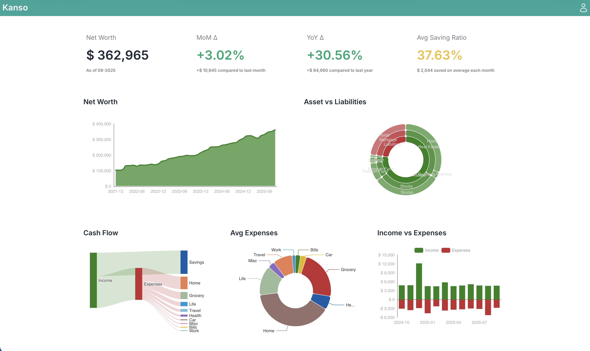

# Kanso – Stop Guessing. Start Knowing.


[](https://codecov.io/gh/dstmrk/kanso)


> **Check your financial health in 5 minutes per month.**
> See exactly where your money goes, spot trends before they become problems, and make confident decisions about your finances.

**📚 [Full Documentation](https://dstmrk.github.io/kanso/)** • **[Quick Install](https://dstmrk.github.io/kanso/installation/)** • **[Feature Guide](https://dstmrk.github.io/kanso/features/overview/)**

<table>
  <tr>
    <td></td>
    <td></td>
  </tr>
  <tr>
    <td align="center"><b>Light Mode</b></td>
    <td align="center"><b>Dark Mode</b></td>
  </tr>
</table>

---

## The Problem

**You work hard. You earn money. But at the end of the month...**

- 🤔 **"Where did it all go?"** - Money disappears. You can't pinpoint where.
- 😟 **"Am I on track?"** - No idea if you're making progress or falling behind.
- 📈 **"Is spending getting worse?"** - You suspect it is, but you can't prove it.
- 😫 **"Spreadsheet fatigue"** - Manual calculations, no charts, exhausting.

**The anxiety is real. The control is missing.**

---

## The Solution

**Kanso gives you clarity without complexity.**

Open your dashboard once a month. In 5 minutes you'll:

1. **See net worth trend** → Answer "Am I on track?" in 10 seconds
2. **Check savings ratio** → Green = doing great, Yellow/Red = time to adjust
3. **Spot spending patterns** → "Oh, I didn't realize I spend that much there"
4. **Make one decision** → Cancel subscription, adjust budget, or celebrate progress

**Result**: Confidence. Control. Calm.

---

## Real-World Example

**Problem**: You earn €4k/month, but account is always near zero. Where does it go?

**What Kanso Shows**:
- 30% goes to food delivery (you didn't realize)
- €200/month in forgotten subscriptions
- Spending grew 15% vs last year (lifestyle inflation creeping in)

**Action You Take**: Cook more, cancel 3 subscriptions, save €400/month from those changes alone.

**This is what "knowing" looks like.**

---

## What You Get

### 📊 Answer "Am I on track?" in 10 seconds
Net worth up? ✅ Savings ratio green? ✅ No spreadsheet archaeology needed. Dashboard shows 4 key metrics that tell you everything.

### 💸 Spot spending patterns before they compound
Year-over-year comparison reveals lifestyle inflation early. Merchant breakdown shows exactly where money flows. Fix issues while they're small.

### 📈 Watch your wealth grow (or catch it shrinking)
Stacked bar chart shows where wealth accumulates over time. Track progress, not just account balances.

### 🔒 Keep financial data under your control
Self-hosted on your infrastructure. No bank connections. Your data stays in Google Sheets. No cloud service reads your transactions. Ever.

**[Full Feature List →](https://dstmrk.github.io/kanso/features/overview/)**

---

## Quick Start

### Docker (5 minutes)

```bash
# Download and start
curl -o docker-compose.yml https://raw.githubusercontent.com/dstmrk/kanso/main/docker-compose.yml
docker compose up -d

# Open http://localhost:9525
```

**That's it.** Follow onboarding wizard to connect Google Sheets.

### Local Development

```bash
git clone https://github.com/dstmrk/kanso.git
cd kanso
uv sync
uv run python main.py  # Open http://localhost:9525
```

📖 **[Installation Guide](https://dstmrk.github.io/kanso/installation/)** • **[Google Sheets Setup](https://dstmrk.github.io/kanso/google-sheets-setup/)**

---

## How It Works

```
📝 Your Google Sheet → 📊 Kanso Dashboard → ✅ Confident Decisions → 💰 Better Financial Health
```

1. **Keep data in Google Sheets** (edit anywhere, familiar interface)
2. **Kanso visualizes automatically** (charts, calculations, trends)
3. **You make informed decisions** (no guessing, no anxiety)

---

## Is Kanso For You?

### ✅ You'll Love Kanso If...

- You **already track finances** in spreadsheets (Kanso visualizes what you have)
- You want **visibility without complexity** (4 KPIs, not 50-category budgets)
- You prefer **monthly reviews** over daily transaction tracking
- You value **data ownership** and self-hosting
- You're **comfortable running Docker** (or asking AI to help you)

### ❌ Kanso Might Not Be For You If...

- You need **automatic bank sync** (Kanso doesn't connect to banks)
- You want **envelope budgeting** or strict category limits
- You expect **set-and-forget** automation (Kanso requires monthly data entry)
- You need a **mobile-first app** (Kanso is web-based, mobile-responsive)

**Honest assessment**: Kanso is for people who manually track finances and want better insights, not for people looking to automate everything.

---

## 🌱 Why "Kanso"?

> *Kanso (簡素)* is a Japanese word meaning **simplicity** and **elimination of the non-essential**.

This is not a tool for daily micro-management. It's for people who want to check in on their finances **once a month**, see big trends, and stay focused on what matters — without noise, stress, or overcomplication.

---

## 🧩 Tech Stack

**Built for reliability and clarity**:

- **[Python 3.13](https://www.python.org/)** + **[NiceGUI](https://nicegui.io)** - Modern async web UI
- **[pandas](https://pandas.pydata.org/)** + **[gspread](https://github.com/burnash/gspread)** - Data processing & Google Sheets
- **[ECharts](https://echarts.apache.org/)** - Interactive visualizations
- **[Docker](https://www.docker.com/)** - Self-contained deployment
- **[pytest](https://pytest.org/)** + **[Playwright](https://playwright.dev/)** - Comprehensive testing

**Not blockchain, not AI, not buzzwords. Just clear insights from your data.**

---

## 📚 Documentation

**Essential guides**:

- **[Features Overview](https://dstmrk.github.io/kanso/features/overview/)** - What can Kanso do?
- **[Dashboard Guide](https://dstmrk.github.io/kanso/features/dashboard/)** - Understand the metrics
- **[Installation](https://dstmrk.github.io/kanso/installation/)** - Get started in 5 minutes
- **[Google Sheets Setup](https://dstmrk.github.io/kanso/google-sheets-setup/)** - Prepare your data
- **[Architecture](https://dstmrk.github.io/kanso/architecture/)** - Technical design
- **[Contributing](https://dstmrk.github.io/kanso/contributing/)** - Development guide

---

## 🛠️ Development

```bash
# Setup and run
git clone https://github.com/dstmrk/kanso.git
cd kanso
uv sync --all-extras
uv run python main.py

# Test and lint
pytest
uv run ruff check .
uv run mypy app
```

**Contributing**: See **[CONTRIBUTING.md](./CONTRIBUTING.md)** for detailed guidelines, test strategy, and CI/CD info.

---

## 📄 License & Support

**License**: MIT - see **[LICENSE](./LICENSE)**

**Support**:
- **Issues**: [GitHub Issues](https://github.com/dstmrk/kanso/issues)
- **Discussions**: [GitHub Discussions](https://github.com/dstmrk/kanso/discussions)
- **Security**: [SECURITY.md](./SECURITY.md)

---

<p align="center">
  <strong>Ready to stop guessing and start knowing?</strong><br/>
  <a href="https://dstmrk.github.io/kanso/installation/">Get Started in 5 Minutes →</a>
</p>

<p align="center">
  Made with ❤️ and a focus on <em>simplicity</em>
</p>
