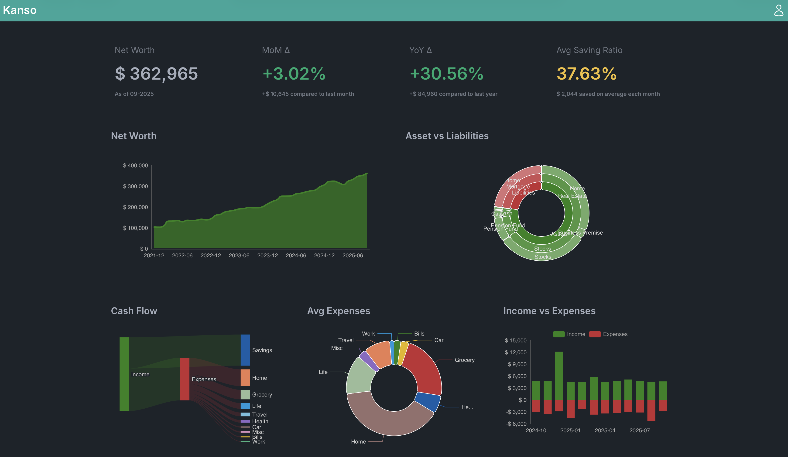

# Kanso – Your Minimal Money Tracker


<table>
  <tr>
    <td></td>
    <td></td>
  </tr>
  <tr>
    <td align="center"><b>Light Mode</b></td>
    <td align="center"><b>Dark Mode</b></td>
  </tr>
</table>

**Kanso** is a minimalist, self-hostable web application designed to help you track your personal finances with clarity and calm. It leverages **Google Sheets** as the data source, and builds clean, interactive dashboards using **gspread**, **NiceGUI**, and **ECharts**.

---

## 🌱 Why "Kanso"?

> *Kanso (簡素)* is a Japanese word meaning **simplicity**, **plainness**, or **elimination of the non-essential**.
> It comes from traditional Japanese aesthetics, emphasizing clarity, intentionality, and calm.
> This tool was built with that spirit in mind: a minimalist finance tracker that doesn't overwhelm you.

---

## 🧘 Philosophy

This is not a tool for micro-managing finances daily.

It's for people who want to check in on their finances once a month, track big trends, and stay focused on what matters — without noise, stress, or overcomplication.

---

## ⚙️ What It Does

- Reads data from a Google Sheets workbook
- Builds monthly and cumulative dashboards for income, expenses, and savings
- Lets you update your data **just once a month**
- Provides a minimalist, low-friction interface via **NiceGUI**
- Uses **ECharts** for beautiful, responsive charts

---

## 🚀 How to Run It

### 1. Clone the repository

```bash
git clone https://github.com/dstmrk/kanso.git
cd kanso
```

### 2. Install [uv](https://docs.astral.sh/uv/) as python package and environment manager
```bash
curl -LsSf https://astral.sh/uv/install.sh | sh # On Windows Powershell: powershell -ExecutionPolicy ByPass -c "irm https://astral.sh/uv/install.ps1 | iex"
```

or
```bash
pip install uv
```

### 3. Set up a virtual environment
```bash
uv venv
source venv/bin/activate  # On Windows: venv\Scripts\activate
```

### 4. Install requirements
```bash
uv sync
```

### 5. Run the app

```bash
uv run main.py
```

Visit http://localhost:6789 to access your dashboard.

### 6. Complete the onboarding setup

On your first visit, Kanso will guide you through a simple 3-step setup:

1. **Welcome** - Introduction to the setup process
2. **Credentials** - Paste your Google Service Account JSON credentials
   - Follow [this guide](https://docs.gspread.org/en/latest/oauth2.html#service-account) to create a service account and get your credentials
   - Simply copy and paste the JSON content into the provided textarea
3. **Configuration** - Enter your Google Sheet URL
   - Provide the URL of your Google Sheet (e.g., `https://docs.google.com/spreadsheets/d/...`)
   - Click "Save & Test Configuration" to validate and save

Your credentials are stored securely in encrypted user storage - **no files or environment variables needed**!

After onboarding, your dashboard will load with beautiful skeleton placeholders while your financial data is being fetched from Google Sheets.

**For Docker deployment**, see [DOCKER.md](./DOCKER.md) for complete instructions.

## 📂 Structure

```bash
kanso/
│
├── main.py                  # Entry point
├── app/                     # Application code
│   ├── core/               # Core config & constants
│   ├── logic/              # Business logic
│   ├── services/           # External services (Google Sheets, data loading)
│   └── ui/                 # UI components (onboarding, home, settings)
├── .env.dev                 # Dev config template (committed)
├── .env.dev.local          # Your dev overrides (gitignored)
├── .env.prod               # Prod config template (committed)
├── .env.prod.local         # Your prod overrides (gitignored)
├── .storage_secret         # Encrypted storage secret (auto-generated, gitignored)
├── Dockerfile              # Docker build config
├── docker-compose.yaml     # Docker orchestration
└── DOCKER.md               # Docker deployment guide
```

> **Note**: Google Sheets credentials are configured through the web UI and stored in encrypted user storage. No credential files or environment variables are required.

## 🧩 Tech Stack

- [gspread](https://github.com/burnash/gspread) – Google Sheets API wrapper
- [NiceGUI](https://nicegui.io) – UI framework for Python Web App
- [ECharts](https://echarts.apache.org/en/index.html) – Data visualizations library
