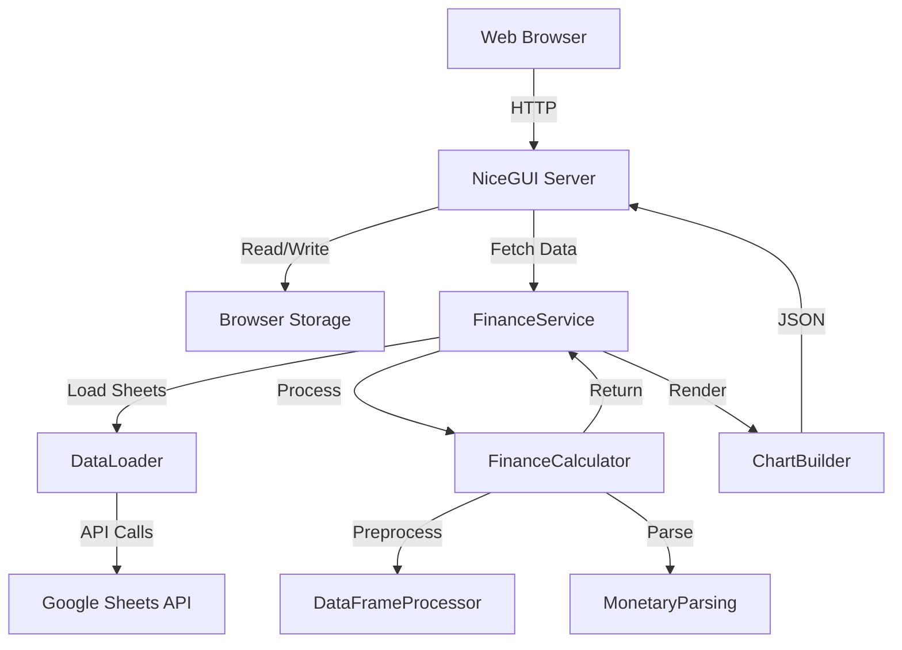
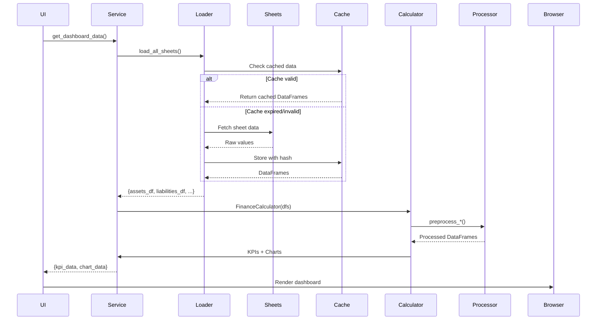

# Architecture Overview

Kanso is built with modern Python async architecture, emphasizing simplicity, performance, and maintainability.

## Technology Stack

### Backend
- **Python 3.13** - Modern async features, type hints
- **NiceGUI** - Reactive web framework built on FastAPI
- **FastAPI** - High-performance async API framework
- **Pandas** - Data manipulation and analysis
- **Google API Client** - Google Sheets integration

### Frontend
- **NiceGUI Components** - Reactive UI elements
- **ECharts** - Interactive data visualizations
- **Tailwind CSS** - Utility-first styling via DaisyUI

### Infrastructure
- **Docker** - Containerized deployment
- **uv** - Fast Python package management
- **pytest** - Comprehensive testing (extensive test coverage)

## High-Level Architecture



## Core Components

### 1. UI Layer (`app/ui/`)

**Responsibility:** User interface and routing

**Key Files:**
- `main.py` - Application entry point, routing
- `home.py` - Dashboard with KPIs and charts
- `onboarding.py` - First-time setup wizard
- `user.py` - Settings and preferences
- `charts.py` - Chart configuration and formatting

**Pattern:** Page-based routing with NiceGUI decorators

```python
@ui.page('/')
async def index():
    # Check if onboarding completed
    if not onboarding_complete():
        ui.navigate.to('/onboarding')
    else:
        ui.navigate.to('/home')
```

### 2. Services Layer (`app/services/`)

**Responsibility:** Business logic and data orchestration

**Key Files:**
- `finance_service.py` - Centralized data access layer
- `data_loader.py` - Google Sheets integration

**Design Pattern:** Service layer pattern for separation of concerns

```python
class FinanceService:
    def get_dashboard_data(self) -> dict[str, Any]:
        """Single call to get all KPIs + charts."""
        calculator = self.get_calculator()
        return {
            "kpi_data": self._calculate_kpis(calculator),
            "chart_data": self._prepare_charts(calculator),
        }
```

**Benefits:**
- UI layer stays thin and focused on presentation
- Business logic is testable independently
- Single source of truth for data access

### 3. Logic Layer (`app/logic/`)

**Responsibility:** Core financial calculations and data processing

**Key Modules:**

#### `finance_calculator.py`
Central calculation engine for financial metrics:
- Net worth tracking (current, MoM, YoY)
- Savings ratio calculation
- Cash flow analysis
- Chart data preparation

```python
class FinanceCalculator:
    def get_current_net_worth(self) -> float:
        """Calculate latest net worth."""

    def get_monthly_net_worth(self) -> list[dict]:
        """Time series for net worth chart."""
```

#### `dataframe_processor.py`
Preprocessing utilities for financial DataFrames:
- Date parsing and normalization
- Column structure detection (single vs multi-index)
- Monetary value summation
- DataFrame sorting and cleaning

```python
class DataFrameProcessor:
    @staticmethod
    def preprocess_expenses(df) -> pd.DataFrame:
        """Parse dates and amounts, sort by date."""

    @staticmethod
    def find_date_column(df) -> str | tuple:
        """Find Date column in single or MultiIndex."""
```

#### `monetary_parsing.py`
Currency detection and value parsing:
- Multi-currency support (EUR, USD, GBP, CHF, JPY)
- Automatic format detection (1.234,56 vs 1,234.56)
- Robust error handling

```python
def parse_monetary_value(value: Any, currency: str = None) -> float:
    """Parse monetary value with intelligent currency detection."""

def detect_currency(value: str) -> str | None:
    """Detect currency from symbol in string."""
```

#### `data_loader.py`
Google Sheets integration with smart caching:
- Hash-based change detection
- Granular sheet-level refresh
- Error handling and retry logic

### 4. Core Layer (`app/core/`)

**Responsibility:** Shared utilities and constants

**Key Modules:**

#### `constants.py`
Centralized constants for consistency:
- Column names (`COL_DATE`, `COL_AMOUNT`)
- Date formats (`DATE_FORMAT_STORAGE`)
- Financial thresholds (`SAVING_RATIO_THRESHOLD_LOW`)

#### `currency_formats.py`
Currency configuration:
- Symbol mappings (€, $, £, Fr, ¥)
- Number format specs (decimal/thousands separators)
- Immutable configuration with Pydantic

```python
@dataclass(frozen=True)
class CurrencyFormat:
    symbol: str
    decimal_sep: str
    thousands_sep: str
    has_decimals: bool

CURRENCY_FORMATS = {
    "EUR": CurrencyFormat("€", ",", ".", True),
    "USD": CurrencyFormat("$", ".", ",", True),
    # ...
}
```

#### `state_manager.py`
Intelligent caching for performance:
- TTL-based cache expiration (24 hours)
- Hash-based invalidation
- Cache statistics

### 5. Data Validation (`app/core/validators.py`)

**Responsibility:** Data validation with Pydantic

**Key Validators:**
- `ExpenseRow` - Validated expense transaction
- `AssetRow`, `LiabilityRow`, `IncomeRow` - Financial data validation

```python
class ExpenseRow(BaseModel):
    date: str
    merchant: str
    amount: str
    category: str
    type: str

    @field_validator('date')
    def validate_date(cls, v):
        # Ensure YYYY-MM format
```

## Data Flow

### Loading Financial Data



### Processing Pipeline

1. **Load** - Fetch raw data from Google Sheets
2. **Parse** - Convert to pandas DataFrames
3. **Preprocess** - Normalize dates, parse amounts, sort
4. **Calculate** - Compute KPIs and aggregations
5. **Format** - Prepare data for charts
6. **Render** - Display in UI

## Performance Optimizations

### 1. Lazy Preprocessing

DataFrames are preprocessed on first access and cached:

```python
@property
def processed_expenses_df(self) -> pd.DataFrame:
    if self._processed_expenses_df is None:
        self._processed_expenses_df = DataFrameProcessor.preprocess_expenses(
            self.expenses_df
        )
    return self._processed_expenses_df
```

### 2. Unified Data Loading

Single calculator instance for all dashboard data:

```python
# ❌ Old: Multiple instances
kpi_data = service.get_kpi_data()  # Creates calculator
chart_data = service.get_chart_data()  # Creates calculator again

# ✅ New: Single instance
dashboard_data = service.get_dashboard_data()  # One calculator
```

### 3. Vectorized Operations

Pandas operations instead of row iteration:

```python
# ❌ Old: Slow iterrows()
for _, row in df.iterrows():
    total += parse_value(row['amount'])

# ✅ New: Vectorized groupby()
df.groupby('category')['amount_parsed'].sum()
```

### 4. Smart Caching

- **Hash-based invalidation**: Only refresh changed sheets
- **TTL cache**: 24-hour expiration for calculations
- **In-memory storage**: Fast repeated access

## Testing Strategy

### Unit Tests (extensive unit tests)

**Coverage:**
- Core logic (`finance_calculator`, `dataframe_processor`)
- Data validation (`validators`)
- Utilities (`monetary_parsing`, `currency_formats`)

**Pattern:**
```python
class TestFinanceCalculator:
    def test_get_current_net_worth(self):
        calc = FinanceCalculator(assets_df=..., liabilities_df=...)
        assert calc.get_current_net_worth() == 50000.0
```

### E2E Tests

**Coverage:**
- Homepage rendering with mock data (smoke tests)
- Complete onboarding flow with validation
- User settings and configuration updates
- Theme toggling and currency selection
- Credentials management and validation

**Tools:** Playwright for browser automation

**Test Suites:**
- `test_home_smoke.py` - Dashboard rendering and data display
- `test_onboarding.py` - First-time user setup flow
- `test_user_settings.py` - Settings page functionality

## Security Considerations

### Data Storage

- **Browser storage**: Credentials stored in browser local storage
- **No server-side storage**: Credentials never stored on server
- **Service account**: Google Sheets access via service account

### Session Management

- **HTTP-only cookies**: Prevent XSS attacks
- **CSRF protection**: Built into FastAPI/NiceGUI
- **Browser-based sessions**: Sessions tied to browser storage

### Google API

- **Service account**: No user OAuth flow
- **Minimal scopes**: Only Google Sheets API
- **Audit logs**: Track all API calls in Google Cloud Console

## Deployment Architecture

### Docker Container

```
kanso/
├── app/           # Application code
├── tests/         # Test suite
├── static/        # CSS, images
├── .env           # Configuration (not in image)
├── Dockerfile     # Multi-stage build
└── docker-compose.yml  # Orchestration
```

**Multi-stage build:**
1. **Builder stage**: Install dependencies with uv
2. **Runtime stage**: Copy only necessary files
3. **Result**: Slim image (~200MB)

### Data Persistence

```yaml
volumes:
  - ./kanso-data:/app/data  # Cache and logs
```

- Survives container restarts
- Contains preprocessed DataFrames
- Stores hash-based change detection state

## Next Steps

- **[API Reference](api-reference.md)** - Deep dive into classes and methods
- **[Contributing](contributing.md)** - Learn how to contribute
- **[Configuration](configuration.md)** - Customize Kanso settings
