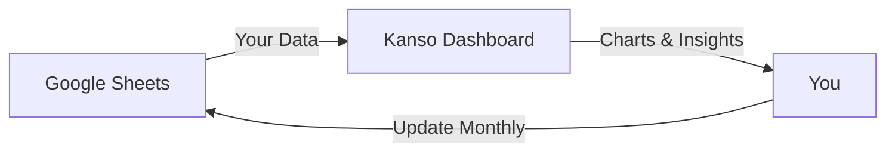

# What You Can Do With Kanso

> **TL;DR**: Check your financial health in 5 minutes per month. See where your money goes, spot trends before they become problems, and make confident decisions about your finances.

## Monthly Financial Check-Ins Made Easy

Most personal finance tools overwhelm you with daily notifications, complex budgeting rules, and endless transaction categorization. Kanso takes a different approach: **calm, monthly check-ins** that give you the insights you need without the anxiety.

---

## What Problems Does Kanso Solve?

### 1. "Am I on Track?" Anxiety

**The Pain**: You're earning, spending, saving... but have no idea if you're making progress or falling behind.

**The Solution**: Net worth tracking shows your financial trajectory at a glance. See if wealth is growing month-over-month and year-over-year.

**Real Example**: Notice net worth dropped 5% last month → Check expense breakdown → Realize one-time car repair was the cause → No panic needed, it's temporary.

---

### 2. Spending Blind Spots

**The Pain**: Money disappears from your account, but you can't pinpoint where.

**The Solution**: Expense analysis by merchant and category reveals patterns. See which merchants take most of your money, compare year-over-year spending.

**Real Example**: Discover 30% of expenses go to food delivery → Decide to cook more → Save €200/month without feeling deprived.

---

### 3. Spreadsheet Fatigue

**The Pain**: Managing finances in Google Sheets works... until you need to calculate trends, create charts, and track ratios manually.

**The Solution**: Keep your data in Google Sheets (easy to edit), but visualize everything in Kanso. No manual calculations, no chart formatting, no formula debugging.

**Real Example**: Update expenses in Google Sheets on your phone → Refresh Kanso dashboard → See updated charts and metrics instantly.

---

### 4. Financial Data Privacy Concerns

**The Pain**: Cloud finance apps read your transactions, sell your data, require linking bank accounts.

**The Solution**: Self-hosted on your infrastructure. Your data never leaves your control. No bank connections required, you input what you want to track.

**Real Example**: Run Kanso on your home server or VPS. Google Sheets integration uses your own API credentials, not ours.

---

## Who Is Kanso For?

### ✅ You'll Love Kanso If...

- You **manually track finances** in spreadsheets already
- You want **visibility without complexity** (no 50-category budgets)
- You prefer **monthly reviews** over daily transaction tracking
- You value **data ownership** and self-hosting
- You're **tech-comfortable** enough to run Docker

### ❌ Kanso Might Not Be For You If...

- You need **automatic bank sync** (we don't connect to banks)
- You want **envelope budgeting** or detailed category limits
- You prefer **mobile-first** native apps (we're web-based)
- You need **shared household tracking** (coming in v2.0)
- You want **set-and-forget** automation (Kanso requires monthly data entry)

---

## Core Capabilities

### 📈 Financial Health Dashboard

**What You Get**: 4 key metrics that answer "Am I doing okay?"

- **Net Worth**: Total wealth (assets - liabilities)
- **Month-over-Month Change**: Are you growing or shrinking?
- **Year-over-Year Change**: Compare to same month last year
- **Savings Ratio**: What % of income you're keeping

**Why It Matters**: Answers the #1 question ("Am I on track?") in 10 seconds.

[:octicons-arrow-right-24: Dashboard Deep Dive](dashboard.md)

---

### 💰 Net Worth Tracking

**What You Get**: Stacked bar chart showing assets and liabilities evolution over time, broken down by type (cash, investments, property, loans, etc.)

**Why It Matters**: See wealth accumulation trends. Notice if one asset class is growing while another stagnates. Spot liability payoff progress.

[:octicons-arrow-right-24: Net Worth Details](net-worth.md)

---

### 💸 Expense Analysis

**What You Get**:
- Year-over-year comparison (with forecast)
- Spending by merchant (top contributors + "Other")
- Spending by type (recurring vs one-time)
- Full transaction history

**Why It Matters**: Understand spending patterns without drowning in detail. Focus on what moves the needle.

[:octicons-arrow-right-24: Expense Breakdown](expenses.md)

---

### 📊 Cash Flow Insights

**What You Get**: Income vs expenses over time, with automatic savings ratio calculation.

**Why It Matters**: See the relationship between earning and spending. Know immediately if you're living beyond your means.

---

## How It Works

1. **Keep your data in Google Sheets** (easy to edit, familiar interface)
2. **Kanso reads and visualizes** (automatic calculations, interactive charts)
3. **You make decisions** based on clear insights (no more guessing)

---

## Technical Foundation

**Why Self-Hosted Matters**:
- Your financial data stays on your infrastructure
- No subscription fees forever
- Customize and extend as needed
- No company can shut down your access

**Why Google Sheets**:
- Edit from any device (phone, tablet, desktop)
- Familiar interface, no learning curve
- Easy backup and export
- Can switch tools anytime (no lock-in)

---

## What's Next?

Ready to see your finances clearly?

- **[Installation Guide](../installation.md)** - Get Kanso running in 5 minutes
- **[Google Sheets Setup](../google-sheets-setup.md)** - Connect your data
- **[Dashboard Walkthrough](dashboard.md)** - Understand the metrics
