# Stop Guessing. Start Knowing.

<div style="text-align: center; margin: 2rem 0;">
  <p style="font-size: 1.3rem; color: var(--md-primary-fg-color);">
    <strong>Check your financial health in 5 minutes per month.</strong><br/>
    See exactly where your money goes, spot trends before they become problems,<br/>
    and make confident decisions about your finances.
  </p>
</div>

---

## The Problem

**You work hard. You earn money. But at the end of the month...**

<div class="grid cards" markdown>

- :material-help-circle: **"Where did it all go?"**

    ---

    Money disappears from your account. You can't pinpoint where. Subscriptions? Dining out? Impulse purchases? No idea.

- :material-alert-circle: **"Am I on track?"**

    ---

    You're earning, spending, saving... but have no clue if you're making progress or falling behind. The anxiety is real.

- :material-chart-line-variant: **"Is spending getting worse?"**

    ---

    You suspect you're spending more than last year, but you can't prove it. No data, just a feeling of losing control.

- :material-table-edit: **"Spreadsheet fatigue"**

    ---

    Google Sheets works for tracking data, but calculating trends, creating charts, and computing ratios manually? Exhausting.

</div>

---

## The Solution

**Kanso gives you clarity without complexity.**

### Before Kanso:
- Open 3 spreadsheets to see full picture
- Calculate net worth manually each month
- Wonder if that Christmas spending was worse than last year
- Feel anxious about money (but can't explain why)

### With Kanso (5 minutes per month):
1. **Open dashboard** → See net worth trend in 10 seconds
2. **Check savings ratio** → Green = doing great, Yellow/Red = time to adjust
3. **Spot spending patterns** → "Oh, I didn't realize I spend that much there"
4. **Make one decision** → Cancel subscription, adjust budget, or celebrate progress

**Result**: Confidence. Control. Calm.

---

## What You Get

<div class="grid cards" markdown>

- :material-speedometer: **Answer "Am I on track?" in 10 seconds**

    ---

    Net worth up? ✅ Keep going.<br/>
    Savings ratio green? ✅ You're doing great.<br/>
    No spreadsheet archaeology needed.

    [:octicons-arrow-right-24: See Dashboard Features](features/dashboard.md)

- :material-chart-box: **Spot spending patterns before they become problems**

    ---

    Year-over-year comparison reveals lifestyle inflation early.<br/>
    Merchant breakdown shows where money actually goes.<br/>
    Fix issues before they compound.

    [:octicons-arrow-right-24: Explore Expense Analysis](features/expenses.md)

- :material-trending-up: **Watch your wealth grow (or catch it shrinking)**

    ---

    Stacked bar chart shows exactly where wealth is accumulating.<br/>
    See assets grow and liabilities shrink over time.<br/>
    Track progress, not just account balances.

    [:octicons-arrow-right-24: Learn Net Worth Tracking](features/net-worth.md)

- :material-shield-lock: **Keep your financial data under your control**

    ---

    Self-hosted on your infrastructure. No bank connections required.<br/>
    Your data stays in your Google Sheets (or local DB soon).<br/>
    No cloud service reads your transactions. Ever.

    [:octicons-arrow-right-24: Quick Installation](installation.md)

</div>

---

## How It Works

```mermaid
graph LR
    A[📝 Your Google Sheet] -->|Monthly Update| B[📊 Kanso Dashboard]
    B -->|Clear Insights| C[✅ Confident Decisions]
    C -->|One Small Change| D[💰 Better Financial Health]
```



**Simple**:

1. **Keep data in Google Sheets** (edit anywhere, familiar interface)
2. **Kanso visualizes automatically** (charts, calculations, trends)
3. **You make informed decisions** (no guessing, no anxiety)

---

## Quick Start

=== "Docker (5 minutes)"

    ```bash
    # Download and start
    curl -o docker-compose.yml https://raw.githubusercontent.com/dstmrk/kanso/main/docker-compose.yml
    docker compose up -d

    # Open http://localhost:6789
    ```

    **That's it.** Follow onboarding wizard to connect Google Sheets.

    [:octicons-arrow-right-24: Detailed Installation Guide](installation.md)

=== "Local Development"

    ```bash
    # Clone and install
    git clone https://github.com/dstmrk/kanso.git
    cd kanso
    uv sync

    # Run
    uv run python main.py

    # Open http://localhost:6789
    ```

    [:octicons-arrow-right-24: Development Setup](contributing.md)

---

## Is Kanso For You?

### ✅ You'll Love Kanso If...

- You **already track finances** in spreadsheets (Kanso visualizes what you have)
- You want **visibility without complexity** (4 KPIs, not 50-category budgets)
- You prefer **monthly reviews** over daily transaction tracking
- You value **data ownership** and self-hosting
- You're **comfortable running Docker** (or asking AI to help you)

### ❌ Kanso Might Not Be For You If...

- You need **automatic bank sync** (Kanso doesn't connect to banks)
- You want **envelope budgeting** or strict category limits
- You expect **set-and-forget** automation (Kanso requires monthly data entry)
- You need a **mobile-first app** (Kanso is web-based, mobile-responsive)

**Honest assessment**: Kanso is for people who manually track finances and want better insights, not for people looking to automate everything.

---

## Real-World Use Cases

**Scenario 1: The "Where did it all go?" Mystery**

**Problem**: You earn €4k/month, but account is always near zero. Where does money go?

**Solution**: Kanso's expense breakdown shows:
- 30% food delivery (you didn't realize)
- €200/month subscriptions (you forgot about)
- Spending grew 15% vs last year (lifestyle inflation)

**Action**: Cook more, cancel 3 subscriptions, save €400/month.

---

**Scenario 2: The Homeowner's Progress Check**

**Problem**: Paying mortgage for 2 years. Am I making progress or treading water?

**Solution**: Net worth chart shows:
- Assets (property) stable at €250k
- Liabilities (mortgage) down from €200k → €190k
- Net worth up €10k (it's working!)

**Action**: Stay the course. Consider extra principal payments.

---

**Scenario 3: The Raise That Disappeared**

**Problem**: Got 10% raise last year. Savings didn't increase. Where did money go?

**Solution**: Year-over-year expense comparison shows:
- Spending also up 10% (lifestyle inflation)
- Dining out doubled (celebrating new income)
- Savings ratio unchanged at 15%

**Action**: Freeze lifestyle. Save 100% of next raise.

---

## Why Self-Hosted?

**Your financial data is private. Keep it that way.**

### Kanso's Approach:
- **Run on your infrastructure** (home server, VPS, or local machine)
- **Connect to your Google Sheets** (using your own API credentials)
- **No cloud middleman** reading your transactions
- **No subscription fees** forever

### What Kanso Never Sees:
- Your transaction data (stays in your Google Sheets)
- Your bank account credentials (no bank connections)
- Your usage patterns (no telemetry)

**Philosophy**: Your financial data should be as private as your medical records. Self-hosting ensures that.

---

## Technical Foundation

Built for reliability and clarity:

- **Python + NiceGUI**: Modern async architecture, snappy UI
- **Google Sheets backend**: Edit from any device, zero lock-in
- **Docker deployment**: Self-contained, easy updates
- **Comprehensive testing**: 322 unit tests + 17 E2E tests
- **Type-safe**: mypy validation ensures correctness

**Not blockchain, not AI, not buzzwords. Just clear insights from your data.**

---

## What's Next?

<div class="grid cards" markdown>

- :material-rocket-launch: **Get Started (5 min)**

    ---

    Install Kanso, connect Google Sheets, see your first dashboard.

    [:octicons-arrow-right-24: Installation Guide](installation.md)

- :material-google: **Prepare Your Data**

    ---

    Learn how to structure Google Sheets for Kanso (or use our template).

    [:octicons-arrow-right-24: Google Sheets Setup](google-sheets-setup.md)

- :material-feature-search: **Explore Features**

    ---

    Understand what you can do with Kanso (dashboards, expense analysis, net worth tracking).

    [:octicons-arrow-right-24: Feature Overview](features/overview.md)

- :material-cog: **Configure & Customize**

    ---

    Dark mode, currency preferences, data refresh settings.

    [:octicons-arrow-right-24: Configuration Guide](configuration.md)

</div>

---

## Questions?

- **[Features Overview](features/overview.md)** - What can Kanso do?
- **[Installation Guide](installation.md)** - How to get started?
- **[Google Sheets Setup](google-sheets-setup.md)** - How to structure data?
- **[Architecture](architecture.md)** - How does Kanso work internally?
- **[GitHub Issues](https://github.com/dstmrk/kanso/issues)** - Found a bug or have a feature request?

---

**Ready to stop guessing and start knowing?**

<div style="text-align: center; margin: 3rem 0;">
  <a href="installation/" class="md-button md-button--primary" style="font-size: 1.2rem; padding: 1rem 2rem;">
    Get Started (5 minutes)
  </a>
</div>
